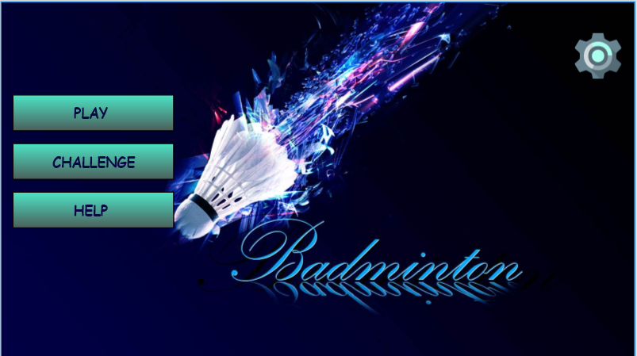
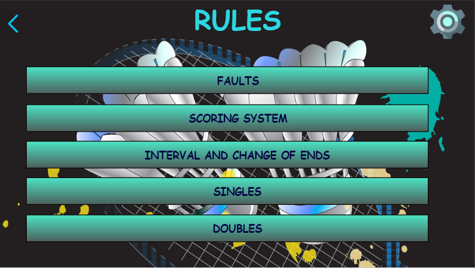
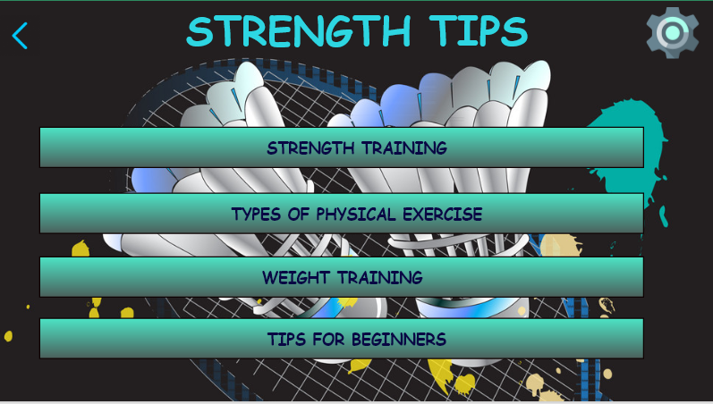
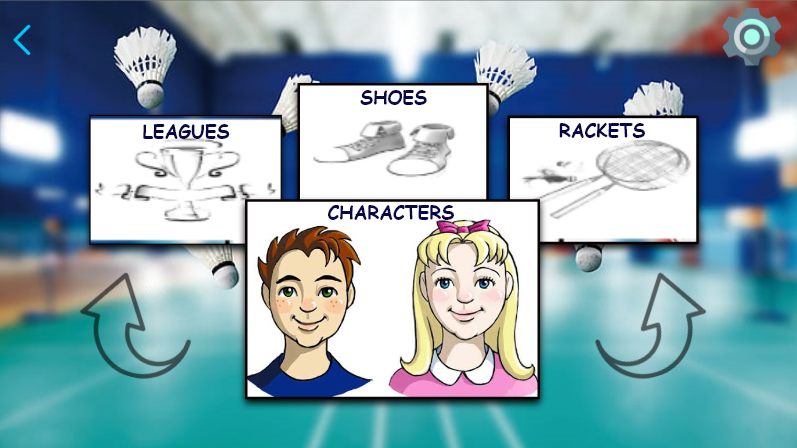
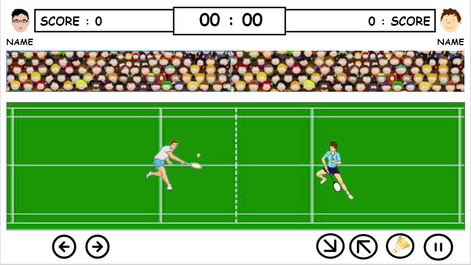

**High Fidelity Prototype**

I have created the application in Adobe XD with the visuals and the connections. Below are few screens that are used in the application. 

Note: I have attached a PDF file for the full gaming application where you can see all the screens. Click on the link to view the file 
<a href="working-mock/Badminton Game.pdf">Badminton Game</a>.

**Home Screen**

**Rules Screen**

**Tips Screen**

**Customize Screen**

**Play Screen**

